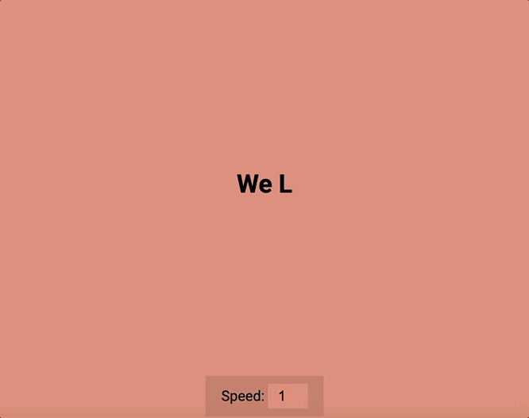

# 📝 Auto Text Effect

This is a creative **Auto Text Effect** built with **HTML**, **CSS**, and **JavaScript**.  
It dynamically types and erases text on the screen, creating a typewriter-like animation—perfect for headers, intros, or interactive UI elements.

---

## 📸 Demo

<p align="center">
  
</p>

---

## 🚀 Features
- Typing and erasing animation ✨  
- Supports multiple text strings  
- Configurable typing speed and pause time  
- Lightweight and dependency-free  

---

## 🛠️ Technologies Used
- HTML  
- CSS  
- JavaScript  

---

## 📂 How to Use
1. Clone the repository:
   ```bash
   git clone https://github.com/JehanAB/AutoTextEffect.git
